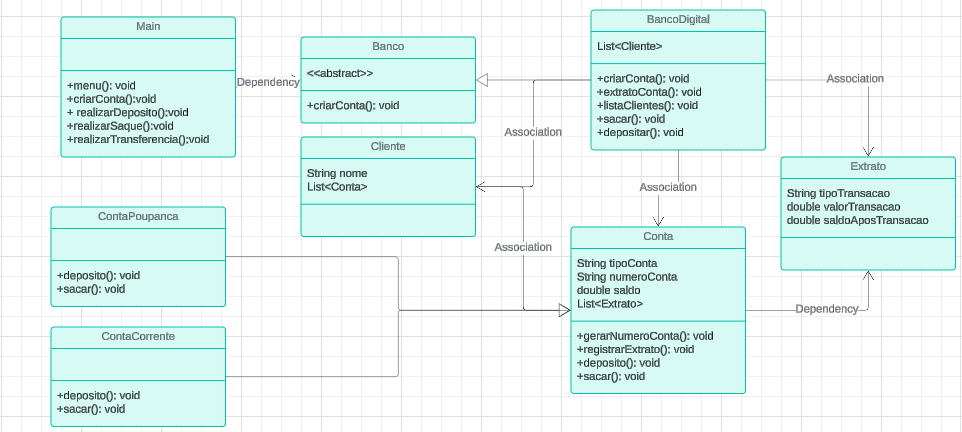

# Banco Digital - Sistema Bancário Simples

Diagrama de classes

## Descrição
Este é um programa de simulação de um banco digital simples, desenvolvido em Java. Ele permite a criação de contas, depósitos, saques, transferências, e consulta de extratos.

## Estrutura do Projeto

O projeto está estruturado da seguinte forma:

- **Main.java**: Contém o menu principal e a lógica de interação com o usuário.
- **BancoDigital.java**: Classe que estende a classe abstrata `Banco`, implementando métodos específicos como criar conta, extrato de conta, listagem de clientes, depósito e saque.
- **Cliente.java**: Representa os dados de um cliente do banco.
- **Conta.java**: Classe abstrata que define métodos e comportamentos básicos de uma conta bancária.
- **ContaCorrente.java**: Classe que estende `Conta`, implementando comportamentos específicos para conta corrente.
- **ContaPoupanca.java**: Classe que estende `Conta`, implementando comportamentos específicos para conta poupança.
- **Extrato.java**: Classe para registrar transações e movimentações financeiras.

## Funcionalidades do Menu

O programa oferece as seguintes opções no menu:

1. **Criar conta**: Permite a criação de uma nova conta para um cliente.
2. **Depósito**: Realiza um depósito em uma conta existente.
3. **Saque**: Realiza um saque de uma conta existente.
4. **Transferência**: Realiza uma transferência entre duas contas.
5. **Listar todos os clientes e saldo**: Mostra uma lista de todos os clientes cadastrados e seus saldos.
6. **Extrato**: Mostra o extrato de uma conta específica.
7. **Sair**: Encerra o programa.

## Instruções de Uso

1. Execute o programa e siga as instruções do menu para realizar operações bancárias.
2. Escolha as opções digitando o número correspondente e siga as instruções adicionais.

## Exemplo de Uso

Para exemplificar o funcionamento, foram criados clientes dummy com contas corrente e poupança com valores iniciais. O número da agência é gerado randomicamente. Para visualizar os dados criados na inicialização, usar a opção 5 do menu. 

## Contribuição

Este projeto foi desenvolvido como exemplo educacional e não aceita contribuições externas.

## Autor

Desenvolvido por [Michel Braga] - [michel.diener@gmail.com]

