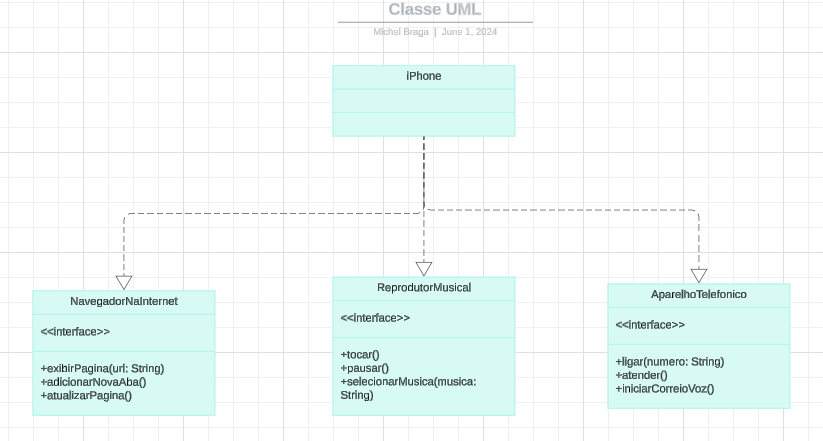

# Simulador de iPhone

## Descrição
O Simulador de iPhone é um programa simples em Java que simula as funcionalidades de um iPhone. Ele permite que os usuários interajam com o iPhone simulado por meio de um menu baseado em texto e realizem ações como reproduzir música, fazer chamadas, enviar mensagens, navegar na internet e mais.

Este projeto é um exercício de Interfaces proposto pelo treinamento DIO Java Bootcamp.

## Funcionalidades
- Reproduzir música: Reproduza música a partir da biblioteca de música do iPhone.
- Fazer chamada: Faça uma ligação para um número de telefone especificado.
- Enviar mensagem: Envie uma mensagem de texto para um número de telefone especificado.
- Abrir navegador: Abra o navegador da web do iPhone e visite uma URL especificada.
- Desligar iPhone: Desligue o iPhone simulado e saia do programa.

## Uso
1. Clone o repositório em sua máquina local.
2. Compile os arquivos Java usando um compilador Java.
3. Execute a classe Main para iniciar o Simulador de iPhone.
4. Siga as instruções na tela para interagir com o iPhone simulado.

## Dependências
- Java Development Kit (JDK)

## Licença
Este projeto está licenciado sob a Licença MIT - consulte o arquivo [LICENSE](LICENSE) para mais detalhes.
